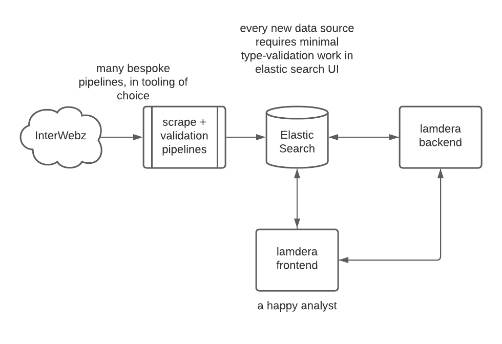
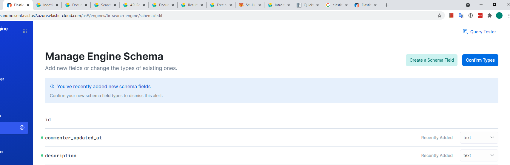

### Motivation:
I really enjoy coding in Lamdera, and want to explore the idea of building a lightweight open-source exploratory data analysis (EDA henceforth) tool. While I haven't pushed Lamdera to the limits (yet), this will require some type of scale. Mario Rogic, the creator of Lamdera, said on this [elm radio podcast](https://open.spotify.com/episode/2NxIl7N5ZlD0oZlCxQXSOF?si=65BpZZq2Sc6yKAXsZSECzA&dl_branch=1) that Lamdera can likely scale vertically to meet the needs of many small businesses. I agree with this for user-facing products, but for internal tools built on top of data warehouses, I don't think Lamdera's pricing structure will work out.

#### A good EDA tool should:
 * be convenient and fast. "fast" here means both fast aggregations and responsive UIs
 * have access to a wide variety of metrics. Analyst shouldn't be scared to perform cross-domain `join`s
 * be cheap, tools like Looker / Tableau are prohibitively expensive!
 * re-inforce good habits through sticky behavior - engineers go out of their way to commit code to Git because it would be insane not to, this is where Lamdera's `evergreen` feature might come in handy.
 * have ingress-glue only. glue code is inevitable, but should be pushed to the data-ingestion process as much as possible. The day-to-day Analyst workflow should be glue-free & engineer-free
 * be analyst-hackable - engineers are expensive, and in practice getting them to work on your internal-facing needs is unlikely until the company is well-established. Additionally, this means crossing semantic boundaries, which means support. There is already precendent for this: Microsoft Excel

#### Hypothesis: Analysts want type systems & no runtime errors, but don't realize it's already possible
Engineers have been engineering their way to better tooling, but this has left analyst tooling behind in the dust. Can a Lamdera app "hug" a data warehouse to provide a delightful data exploration platform?

Reviewing the Elm architecture:
For more details see [the Elm docs](https://guide.elm-lang.org/architecture/), but the gist is:
 * you define `Model` and `Msg` types. `Model` describes the state needed to run your app, `Msg` describes all the things that can happen in your app
 * Then, you must supply four things:
    * `init` your model
    * `update` your model to its new state, upon receiving a msg
    * `subscribe` to msgs from others / system (setting an event to fire ever X seconds is a simple example)
    * render your model's `view`, outputs HTML for the browser to render

Lamdera:
For more details see [the lamdera docs](https://dashboard.lamdera.app/docs), but the gist is:
 * generalizes `Model` to `FrontendModel` annd `BackendModel`, each with an `init` function
 * generalizes `Msg` to `Frontengdsg` and `BackendMsg`
 * provides bridges `toBackend` and `toFrontend`
 * evergreen migrations enforce type-safety across schema changes - this can get a bit complicated, but I think there's potential here to build some really slick code-free tooling

Fir??:
 * allows for raw data to live outside of lamdera?
 * metadata, instructions for aggregations, slices, regressions, etc managed by Lamdera

#### Prctical prototyping
After some thinking and reading, I believe Elastic Search Cloud is the least-gluey practical option for protoyping this architecture. I've already set up a new instance, and got some toy data indexed.

Here's a diagram of the architecture I'm pursuing first. If you're new to Lamdera, note that the backend and frontend are a single code-repo, working together glueless-ly.

#### Last idea:
An example of the post-schema change notification panel. When adding new types of data to an index, elastic cloud notifies you to confirm the types (it presents it's best guess). This is pretty cool, I like this approach better than [Great Expectations](https://greatexpectations.io/). Is there a possible UI that can give us an "evergreen-ed" version of this?

