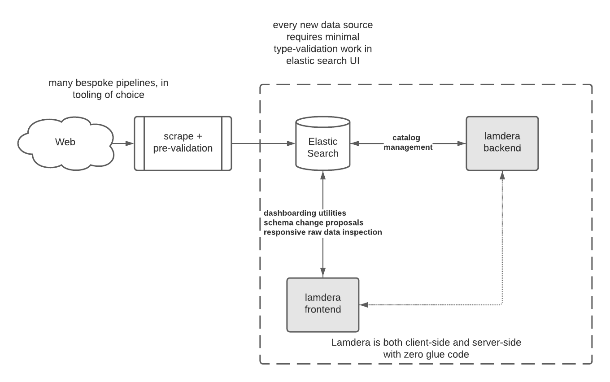

### Motivation:
I really enjoy coding in Lamdera, and want to explore the idea of a simple open-source exploratory data analysis (EDA henceforth) tool. While I haven't pushed Lamdera to the limits (yet), this will require some type of scale. Mario Rogic, the creator of Lamdera said on a podcast that Lamdera can likely scale vertically to meet the needs of many small businesses. I agree with this for user-facing products, but for internal tools built on top of data warehouses, I don't think Lamdera's pricing structure will workout.

#### A good EDA tool should:
 * be convenient, fast. "fast" here means both fast aggregations and responsive UIs
 * have access to a wide variety of metrics, and Analyst shouldn't be scared to perform cross-domain `join`s
 * be cheap, tools like Looker / Tableau are prohibitively expensive!means glue code, which means support burden
 * re-inforce good habits through sticky behavior - engineers go out of their way to commit code to Git because it would be insane not to
 * have ingress-glue only. glue code is inevitable, but should be pushed to the data-ingestion process as much as possible. The day-to-day Analyst workflow should be glue-free & engineer-free
 * be analyst-hackable - engineers are expensive, and in practice getting them to work on your internal-facing needs is unlikely until the company is well-established. Additionally, this means crossing semantic boundaries, which means support 

#### Hypothesis: Analysts want type systems and no runtime errors.
Can a Lamdera app "hug" a data warehouse to provide a delightful data exploration platform? 

Reviewing the Elm architecture:
For more details see [the Elm docs](https://guide.elm-lang.org/architecture/), but the gist is:
 * you define `Model` and `Msg` types. `Model` describes the state needed to run your app, `Msg` describes all the things that can happen in your app
 * Then, you must supply four things:
    * `init` your model
    * `update` your model to its new state, upon receiving a msg
    * `subscribe` to msgs from others / system (setting an event to fire ever X seconds is a simple example)
    * render your model's `view`, outputs HTML for the browser to render

Lamdera:
For more details see [the lamdera docs](https://dashboard.lamdera.app/docs), but the gist is:
 * generalizes `Model` to `FrontendModel` annd `BackendModel`, each with an `init` function
 * generalizes `Msg` to `Frontengdsg` and `BackendMsg`
 * provides bridges `toBackend` and `toFrontend`
 * evergreen migrations enforce type-safety across schema changes - this can get a bit complicated, but I think there's potential here to build some really slick code-free tooling

#### Prctical prototyping

This is interesting, I find this key when considering the practicalities of a data-driven organization. Software engineering technical skill is hard to come by, and you'll have to do some finagling to get them to support your project. Here, the type checking can be in the hands of the analyst. The post-upload notifactions.

The post-upload notifactions.

