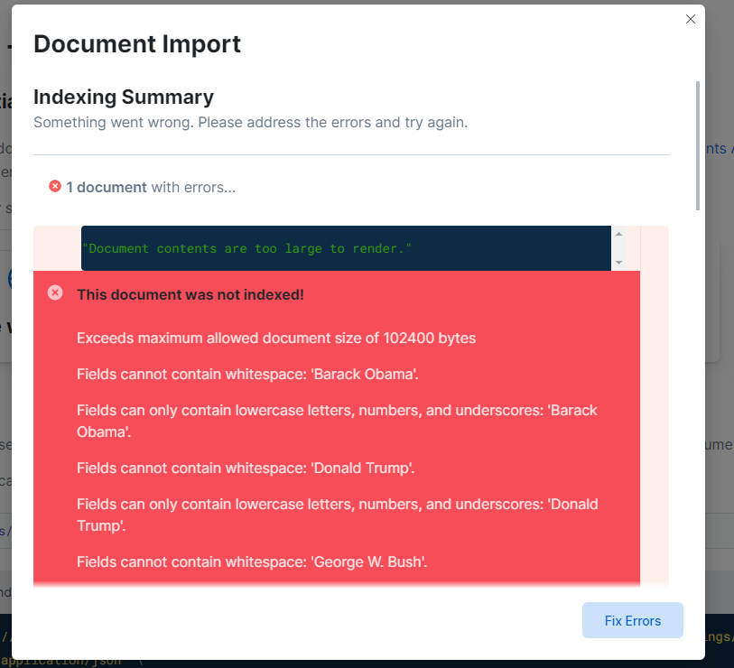

#### presidential approval rating data [didn't work, see updated procedure below]:

Note: Even though this didn't work, I think the docs might be useful in describing what problem I'm trying to solve..

pre-reqs:
 * This chrome extension installed https://workspace.google.com/marketplace/app/export_sheet_data/903838927001
 * An Elastic Cloud instance: https://cloud.elastic.co/home

source:
 * [Google Sheets raw data](https://docs.google.com/spreadsheets/d/1iEl565M1mICTubTtoxXMdxzaHzAcPTnb3kpRndsrfyY/edit#gid=671375968) via [The American Presidency Project](https://www.presidency.ucsb.edu/statistics/data/presidential-job-approval)

steps:
 * copy document (so that we can use add-ons)
 * add-ons (takes a sec to render) -> export data -> open side bar
 * under `Advanced` check the box `Include first column` This changes the output format from this:
 ```json
   "Barack Obama": {
    "Mon Jan 16 2017 03:00:00 GMT-0500 (Eastern Standard Time)": {
      "End Date": "2017-01-19T08:00:00.000Z",
      "Approving": 59,
      "Disapproving": 37,
      "Unsure/NoData": 4
    }
```

to this, note that the outer value gets duplicated into the `Start Date` field.
```json
  "Barack Obama": {
    "Mon Jan 16 2017 03:00:00 GMT-0500 (Eastern Standard Time)": {
      "Start Date": "2017-01-16T08:00:00.000Z",
      "End Date": "2017-01-19T08:00:00.000Z",
      "Approving": 59,
      "Disapproving": 37,
      "Unsure/NoData": 4
    }
```

 * Moving on.. next go to your [Elastic Cloud Dashbord](https://fir-sandbox.ent.eastus2.azure.elastic-cloud.com/ent/select)
 * App search -> Create An Engine ->
 * Engine name: `presidential-approval-ratings` (`_` is unsupported .. -_-)
 * Language: `English`
 * Import JSON file
 * ...and, set back:
 

Two problems:
 * file size, I didn't expect to run into this limitation with this dataset size :/
 * whitespace in field-names names

Well, I've already run into the very issue I'm trying to solve! At this point I'm starting to develop a more solid vision of an (Elm) drag-and-drop interface to handle these sorts of errors

I want to collect more examples like this before I start hands-on work. So I'm kicking the can here a bit, and going to do with a Python-based import script using the `dev-kit` image

##### updated procure for presidential approval rating:


pre-reqs:
 * This chrome extension installed https://workspace.google.com/marketplace/app/export_sheet_data/903838927001
 * An Elastic Cloud instance: https://cloud.elastic.co/home

source:
 * [Google Sheets raw data](https://docs.google.com/spreadsheets/d/1iEl565M1mICTubTtoxXMdxzaHzAcPTnb3kpRndsrfyY/edit#gid=671375968) via [The American Presidency Project](https://www.presidency.ucsb.edu/statistics/data/presidential-job-approval)

steps:
 * in Slides, make your own copy of the document (so that we can use add-ons)
 * add-ons -> export data I noticed this took a min to render so give it a sec) -> open side bar
 * under `Advanced` check the box `Include first column` This changes the output format from this:
 ```json
   "Barack Obama": {
    "Mon Jan 16 2017 03:00:00 GMT-0500 (Eastern Standard Time)": {
      "End Date": "2017-01-19T08:00:00.000Z",
      "Approving": 59,
      "Disapproving": 37,
      "Unsure/NoData": 4
    }
```

to this, note that the outer value gets duplicated into the `Start Date` field.
```json
  "Barack Obama": {
    "Mon Jan 16 2017 03:00:00 GMT-0500 (Eastern Standard Time)": {
      "Start Date": "2017-01-16T08:00:00.000Z",
      "End Date": "2017-01-19T08:00:00.000Z",
      "Approving": 59,
      "Disapproving": 37,
      "Unsure/NoData": 4
    }
```
In either case, we have a problem of the title of the outer field not really making sense. One solution to this is to add a row_id, I'm surprised this isn't in the export packge, and doing
this in google sheets would require cycling through all the sheets (or perhaps there's an add-on for that too). That's too much manual effort. I'm wondering if we could use evergreen to fix this. 

 * moving on.. download JSON file via the side bar
 * Go to [ES Dashbord](https://fir-sandbox.ent.eastus2.azure.elastic-cloud.com/ent/select) -> Launch Search App -> Create An Engine
 * Form filled out:
    name: `presidential-approval-ratings`
    Language: `English`
 * using `dev-kit` image, run `./shell-scripts/presidential_approval_pipeline.py` from the top-level directory


 #### Generating starting points for encoder / decoders
Using this awesome tool: https://korban.net/elm/json2elm/


seeds:
```json
{
    "query": "this is a query",
    "filters" : {
         "president_name": [ "Barack Obama"]
    },
    "page": {
        "current": 4,
        "size": 100
    }
}

```

And it's response:
```json
{
    "meta": {
        "alerts": [],
        "warnings": [],
        "precision": 2,
        "page": {
            "current": 1,
            "total_pages": 42,
            "total_results": 418,
            "size": 10
        },
        "engine": {
            "name": "presidential-approval-ratings-dev",
            "type": "default"
        },
        "request_id": "3R72W4TLT7qtlz_2bq7LQw"
    },
    "results": [
        {
            "end_date": {
                "raw": "2015-03-01T08:00:00+00:00"
            },
            "unsure_no_data": {
                "raw": 5.0
            },
            "president_name": {
                "raw": "Barack Obama"
            },
            "disapproving": {
                "raw": 50.0
            },
            "approving": {
                "raw": 45.0
            },
            "start_date": {
                "raw": "2015-02-23T08:00:00+00:00"
            },
            "_meta": {
                "engine": "presidential-approval-ratings-dev",
                "score": 1.0,
                "id": "doc-613f4b72e31f699dbfc34d76"
            },
            "id": {
                "raw": "doc-613f4b72e31f699dbfc34d76"
            }
        },
        {
            "end_date": {
                "raw": "2015-03-08T08:00:00+00:00"
            },
            "unsure_no_data": {
                "raw": 5.0
            },
            "president_name": {
                "raw": "Barack Obama"
            },
            "disapproving": {
                "raw": 49.0
            },
            "approving": {
                "raw": 46.0
            },
            "start_date": {
                "raw": "2015-03-02T08:00:00+00:00"
            },
            "_meta": {
                "engine": "presidential-approval-ratings-dev",
                "score": 1.0,
                "id": "doc-613f4b72e31f699dbfc34d75"
            },
            "id": {
                "raw": "doc-613f4b72e31f699dbfc34d75"
            }
        },
        {
            "end_date": {
                "raw": "2015-04-19T07:00:00+00:00"
            },
            "unsure_no_data": {
                "raw": 4.0
            },
            "president_name": {
                "raw": "Barack Obama"
            },
            "disapproving": {
                "raw": 50.0
            },
            "approving": {
                "raw": 46.0
            },
            "start_date": {
                "raw": "2015-04-13T07:00:00+00:00"
            },
            "_meta": {
                "engine": "presidential-approval-ratings-dev",
                "score": 1.0,
                "id": "doc-613f4b72e31f699dbfc34d6f"
            },
            "id": {
                "raw": "doc-613f4b72e31f699dbfc34d6f"
            }
        },
        {
            "end_date": {
                "raw": "2015-05-03T07:00:00+00:00"
            },
            "unsure_no_data": {
                "raw": 4.0
            },
            "president_name": {
                "raw": "Barack Obama"
            },
            "disapproving": {
                "raw": 48.0
            },
            "approving": {
                "raw": 48.0
            },
            "start_date": {
                "raw": "2015-04-27T07:00:00+00:00"
            },
            "_meta": {
                "engine": "presidential-approval-ratings-dev",
                "score": 1.0,
                "id": "doc-613f4b72e31f699dbfc34d6d"
            },
            "id": {
                "raw": "doc-613f4b72e31f699dbfc34d6d"
            }
        },
        {
            "end_date": {
                "raw": "2015-05-10T07:00:00+00:00"
            },
            "unsure_no_data": {
                "raw": 5.0
            },
            "president_name": {
                "raw": "Barack Obama"
            },
            "disapproving": {
                "raw": 48.0
            },
            "approving": {
                "raw": 47.0
            },
            "start_date": {
                "raw": "2015-05-04T07:00:00+00:00"
            },
            "_meta": {
                "engine": "presidential-approval-ratings-dev",
                "score": 1.0,
                "id": "doc-613f4b72e31f699dbfc34d6c"
            },
            "id": {
                "raw": "doc-613f4b72e31f699dbfc34d6c"
            }
        },
        {
            "end_date": {
                "raw": "2015-05-17T07:00:00+00:00"
            },
            "unsure_no_data": {
                "raw": 4.0
            },
            "president_name": {
                "raw": "Barack Obama"
            },
            "disapproving": {
                "raw": 49.0
            },
            "approving": {
                "raw": 47.0
            },
            "start_date": {
                "raw": "2015-05-11T07:00:00+00:00"
            },
            "_meta": {
                "engine": "presidential-approval-ratings-dev",
                "score": 1.0,
                "id": "doc-613f4b72e31f699dbfc34d6b"
            },
            "id": {
                "raw": "doc-613f4b72e31f699dbfc34d6b"
            }
        },
        {
            "end_date": {
                "raw": "2015-05-24T07:00:00+00:00"
            },
            "unsure_no_data": {
                "raw": 5.0
            },
            "president_name": {
                "raw": "Barack Obama"
            },
            "disapproving": {
                "raw": 49.0
            },
            "approving": {
                "raw": 46.0
            },
            "start_date": {
                "raw": "2015-05-18T07:00:00+00:00"
            },
            "_meta": {
                "engine": "presidential-approval-ratings-dev",
                "score": 1.0,
                "id": "doc-613f4b72e31f699dbfc34d6a"
            },
            "id": {
                "raw": "doc-613f4b72e31f699dbfc34d6a"
            }
        },
        {
            "end_date": {
                "raw": "2015-05-31T07:00:00+00:00"
            },
            "unsure_no_data": {
                "raw": 4.0
            },
            "president_name": {
                "raw": "Barack Obama"
            },
            "disapproving": {
                "raw": 49.0
            },
            "approving": {
                "raw": 47.0
            },
            "start_date": {
                "raw": "2015-05-25T07:00:00+00:00"
            },
            "_meta": {
                "engine": "presidential-approval-ratings-dev",
                "score": 1.0,
                "id": "doc-613f4b72e31f699dbfc34d69"
            },
            "id": {
                "raw": "doc-613f4b72e31f699dbfc34d69"
            }
        },
        {
            "end_date": {
                "raw": "2015-07-05T07:00:00+00:00"
            },
            "unsure_no_data": {
                "raw": 5.0
            },
            "president_name": {
                "raw": "Barack Obama"
            },
            "disapproving": {
                "raw": 49.0
            },
            "approving": {
                "raw": 46.0
            },
            "start_date": {
                "raw": "2015-06-29T07:00:00+00:00"
            },
            "_meta": {
                "engine": "presidential-approval-ratings-dev",
                "score": 1.0,
                "id": "doc-613f4b72e31f699dbfc34d64"
            },
            "id": {
                "raw": "doc-613f4b72e31f699dbfc34d64"
            }
        },
        {
            "end_date": {
                "raw": "2015-07-12T07:00:00+00:00"
            },
            "unsure_no_data": {
                "raw": 5.0
            },
            "president_name": {
                "raw": "Barack Obama"
            },
            "disapproving": {
                "raw": 49.0
            },
            "approving": {
                "raw": 46.0
            },
            "start_date": {
                "raw": "2015-07-06T07:00:00+00:00"
            },
            "_meta": {
                "engine": "presidential-approval-ratings-dev",
                "score": 1.0,
                "id": "doc-613f4b72e31f699dbfc34d63"
            },
            "id": {
                "raw": "doc-613f4b72e31f699dbfc34d63"
            }
        }
    ]
}
```


##### fir02 provisioning

`fir01` was an Ubuntu VM I abandonded since the default repos were really stale. Honestly this is 

Goal is to get a fresh VM up and running with just elastic search, scrappy.

In GCP Compute engine `fir02` is set up on Container Optimized OS, the newest long-support version.


`ssh` into the VM
```bash
mkdir deploy
cd deploy
git clone https://github.com/rob-sokolowski-git-org/fir-sandbox.git
cd fir-sandbox/elastic-search

sudo apt-get update
sudo apt-get install docker.io
sudo apt-get install docker-compose
sudo apt-get install docker-compose
```
